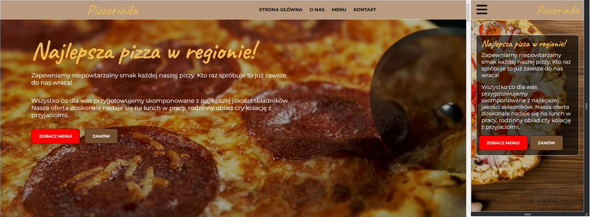
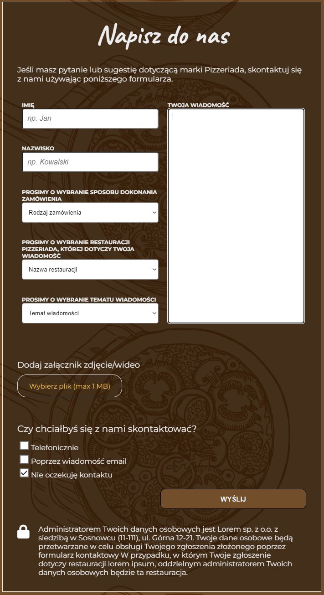
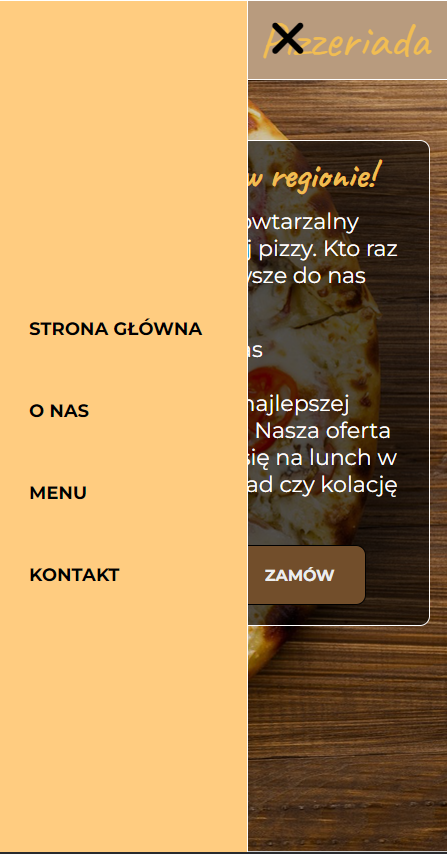
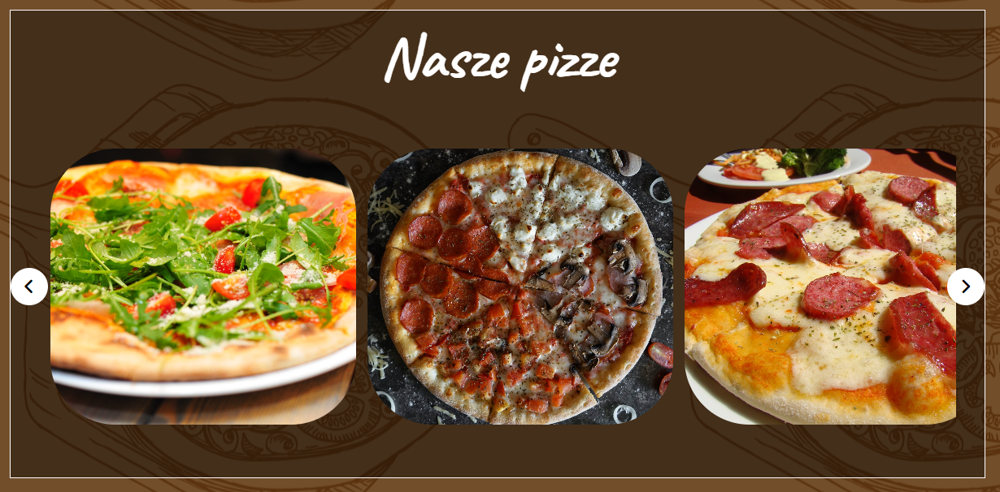
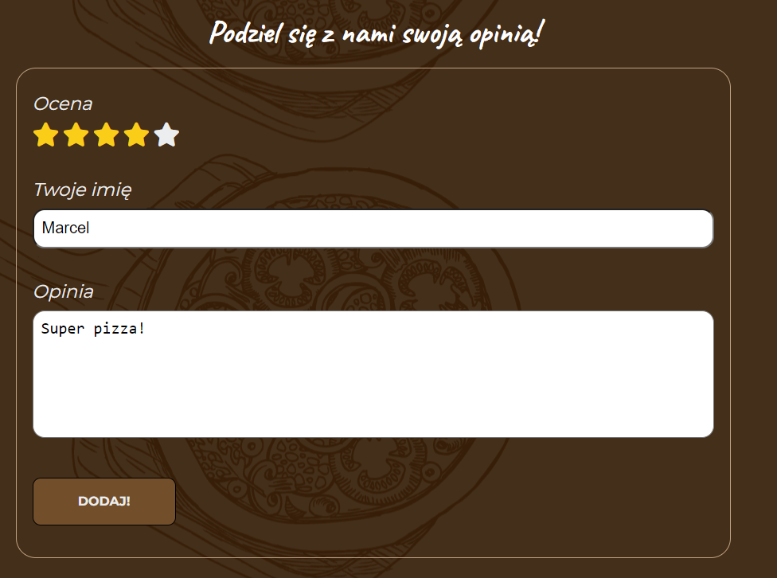
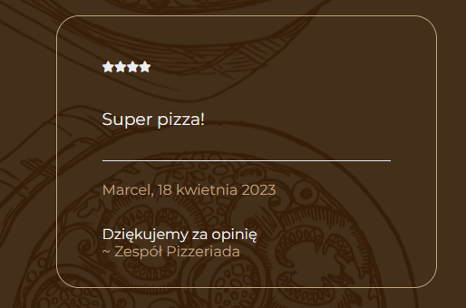

## Documentation / Dokumentacja

<ul class="nav nav-tabs" id="myTab" role="tablist">
  <li class="nav-item">
    <a class="nav-link active" id="english-tab" data-toggle="tab" href="#english" role="tab" aria-controls="english" aria-selected="true">English Version</a>
  </li>
  <li class="nav-item">
    <a class="nav-link" id="polish-tab" data-toggle="tab" href="#polish" role="tab" aria-controls="polish" aria-selected="false">Polish Version</a>
  </li>
</ul>

  

# Pizzeriada

## Project Launch

<strong>Access the website directly through the link:</strong>
[Pizzeriada](https://mnedza.github.io/Pizzeriada/)

    Alternatively, download the project from the GitHub repository:

`git clone https://github.com/mnedza/Pizzeriada.git`

    Navigate to the project directory:

`cd Pizzeriada`

    Launch the index.html file in your browser.

## Technologies Used

    - JavaScript
    - SCSS
    - HTML

## Project Structure

    The index.html file has a modular code structure, importing individual JavaScript and SCSS files. This makes the code more organized and easier to maintain.

    BEM (Block Element Modifier) methodology was used to style the page, allowing for better organization and structure of the CSS code. This makes styling more clear and easier to maintain.

    The project was designed in accordance with UX (User Experience) and UI (User Interface) principles, which contributed to better usability and an attractive appearance of the website.

    The JavaScript code was written in an easily understandable and maintainable way. Good programming practices were applied, such as avoiding repetitive code, which allows other people to understand the code faster.

    The project is responsive, which means that the website adapts to different screen sizes. This makes it easy for users to browse the website on various devices, such as computers, tablets, and smartphones.

## Project Description

    Pizzeriada is my first personal project of a website in Polish language.

  
`What elements does the website contain?`

1. Contact form

2. Mobile navigation

3. Photo gallery

4. Section where you can share your opinion

As well as many informational sections and their responsive counterparts for mobile devices, such as the pizzeria homepage.

    Pizzeria homepage:

 

    Contact form:

 

    Mobile navigation:

 

    Photo gallery:

 

    Customer review section:

 

    After adding a review:

 

## Summary
    Thanks to creating this project, I have learned the basics of creating websites in HTML, CSS, and JavaScript. Additionally, I gained knowledge about UX, UI, and the SCSS preprocessor.

## Authors
    1. Marcel Nędza

  

  

# Pizzeriada

## Uruchomienie projektu

<strong>Wejdź na stronę bezpośrednio przez link:</strong>
[Pizzeriada](https://mnedza.github.io/Pizzeriada/)

    Lub pobierz projekt z repozytorium GitHub:

`git clone https://github.com/mnedza/Pizzeriada.git`

    Przejdź do katalogu z projektem:

`cd Pizzeriada`

    Uruchom plik index.html w przeglądarce.

## Użyte technologie

    - JavaScript
    - SCSS
    - HTML

## Struktura projektu

    W pliku index.html zastosowano modułową strukturę kodu, importując poszczególne pliki JavaScript i SCSS. Dzięki temu kod jest bardziej przejrzysty i łatwiejszy do utrzymania.  
  
    W stylowaniu strony wykorzystano metodologię BEM (Block Element Modifier), co pozwoliło na lepszą organizację i strukturyzację kodu CSS. Dzięki temu stylowanie jest bardziej przejrzyste i łatwiejsze do utrzymania.

    Projekt został zaprojektowany zgodnie z zasadami UX (User Experience) i UI (User Interface), co przyczyniło się do lepszej użyteczności strony i jej atrakcyjnego wyglądu.

    Kod JavaScript został napisany w sposób łatwy do zrozumienia i utrzymania. Zastosowane zostały dobre praktyki programistyczne, takie jak unikanie powtarzającego się kodu co pozwala na szybsze zrozumienie kodu przez inne osoby.

    Projekt jest responsywny, co oznacza, że strona dostosowuje się do różnych rozmiarów ekranów. Dzięki temu użytkownicy mogą łatwo przeglądać stronę na różnych urządzeniach, takich jak komputery, tablety i smartfony.

## Opis projektu

    Pizzeriada to mój pierwszy prywatny projekt strony internetowej w języku polskim. 
  
`Jakie elementy zawiera strona?`

1. Formularz kontaktowy

2. Nawigacja mobilnea

3. Galeria zdjęć

4. Sekcję, w której możesz podzielić się swoją opinią

Oraz wiele sekcji informacyjnych oraz ich responsywne odpowiedniki na urządzenia mobilne np. strona główna pizzerii.

    Strona główna pizzerii:

 

    Formularz kontaktowy:

 

    Nawigacja mobilna:

 

    Galeria zdjęć:

 

    Sekcja dzielenia się opinią:

 

    po dodaniu opinii:

 

## Podsumowanie
    Dzięki stworzeniu tego projektu nauczyłem się podstaw tworzenia stron internetowych w HTML, CSS oraz JavaScript. Oprócz tego, zdobyłem wiedzę na temat UX, UI oraz preprocesora SCSS.

## Autorzy
    1. Marcel Nędza
  

